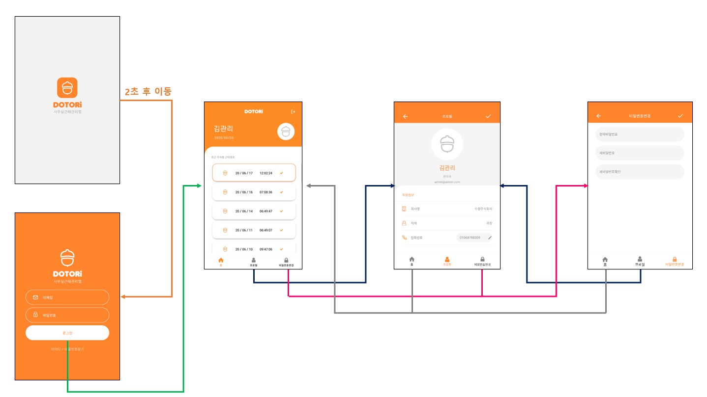
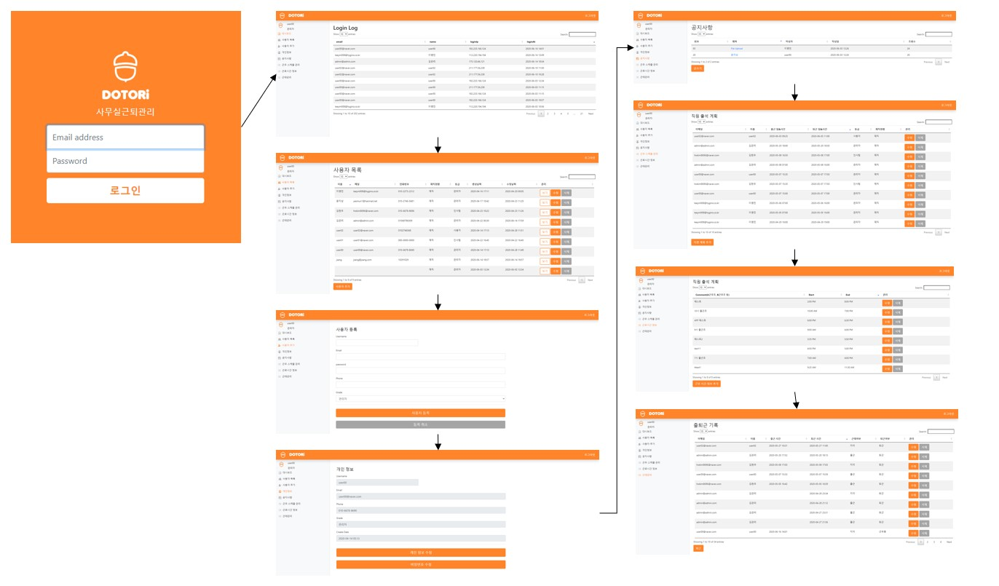

# DOTORi   
## 자동 근태 관리 시스템
> 프로젝트 기간 : 20.04.01 ~ 20.06.25

```
📌 근무지 내 출퇴근을 자동으로 처리하여 수동으로 동작하는 번거로움 해소

📌 초과 근무 처리가 가능하며, 웹에서 자동으로 근태를 관리

📌 사용자와 관리자의 이용 및 관리 부담을 줄이며 편리한 인사관리 업무수행 가능

📌 쉽고 간편한 디자인으로 누구나 사용하기 편함 
```

## TEAM (Developer) 👩🏻‍💻👨🏻‍💻
- 김수정 (App) - [suzumsz](https://github.com/suzumsz) 
- 문지상 (App)
- 김현우 (Web)

## 기능소개 
|  담당자  |   기능설명   |   구현여부   |                              
| :----------: | :----------------: | :----------: |
|김수정| Photoshop과 Illustrator를 이용한 앱/웹의 UI/UX 및 로고 디자인, builderX를 이용하여 어플리케이션 전체적인 레이아웃 및 디자인 구성 (로고화면, 로그인 화면, 대시보드, 프로필, 비밀번호 수정), 레이아웃에 맞춘 어플리케이션 전체 페이지 코딩 | ⭕ |
|문지상| Server와 통신하기 위한 API Controller 생성, API 구현(로그인, 로그아웃, 근태목록, 사용자정보 및 수정, 비밀번호 수정), Background에서 Beacon과 통신하여 근태 처리하는 기능 구현 | ⭕ |
|김현우| 로그인, 로그아웃, 로그인 로그, 사용자 목록, 사용자 추가, 개인정보(수정, 비밀번호 변경), 사용자 정보(수정, 삭제), 공지사항, 근무 스케줄 관리, 근로시간 정보, 근태관리 등 대부분의 웹 기능 | ⭕ |

## Workflow

- App


- Web


## 개발환경
       
 

## 참고
✔ [도토리 발표 ppt 파일](/etc/근태관리시스템_ppt.pptx)  
✔ [앱 구성도 및 사용된 기능](/etc/앱구성도.pptx) 참고  
✔ [웹 구성도 및 사용된 기능](/etc/웹구성도.pptx) 참고 

<details>
<summary> 실행 </summary>
<div markdown="1">

```
react-native run-android
```

</div>
</details>


 
